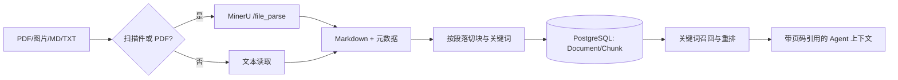

# WaterWeb Agent 与 RAG 上线设计

## 运行边界

传感器工具当前是 `waterweb-simulator`，每份结果都带 `is_simulated=true`、`data_quality=simulated`；提示词要求回答显式说明“模拟数据”。真实物联网接入时，为每类设备实现同名工具适配器，并且只在网关鉴权、设备白名单、审计日志均启用后替换模拟器。控制工具在当前版本仍只模拟执行。

## 对话与上下文

每次请求按以下顺序组装：角色/安全系统提示词 → 不超过 2,000 字的长期记忆 → 最近完整对话（最多 12,000 字）→ 当前问题 → RAG 证据 → 受权限约束的工具。长期记忆只保留用户明确表达的区域、设备、偏好和待办，绝不写入工具输出、密钥或模型推测。超出预算优先丢弃最早的短期对话，不能丢弃系统提示词、当前问题或工具结果。

提示词约束：传感器数字必须来自工具；模拟数据必须标记；制度回答必须标 `[K1]` 等证据编号；资料没有覆盖时说明不知道；涉及控制先复述目标并取得确认。将生产系统提示词作为受版本控制的代码，不允许由前端直接覆盖。

## RAG 数据流



新增表 `AiKnowledgeDocument` 保存原始资料校验和、解析器、状态及失败原因；`AiKnowledgeChunk` 保存分块、关键词、页码和可选 embedding。当前检索先走可运行的中文关键词混合召回，旧 `AiKnowledge` 继续兼容。第二阶段建议使用 PostgreSQL + pgvector，将 embedding 写入专用向量列并与关键词结果做 RRF 融合；不要把向量 JSON 当作大规模生产索引。

## 导入资料

服务器上的原始资料目录固定建议为 `/opt/waterweb/data/knowledge/`；在 `.env` 中设置
`KNOWLEDGE_SOURCE_DIR=/opt/waterweb/data/knowledge` 后，它会以只读方式挂载到后端容器的
`/data/knowledge/`。该目录保存原始 PDF/图片/Markdown，不存向量；解析后的分块和（后续）向量索引保存在 PostgreSQL 中。

普通 Markdown/TXT：

```bash
docker compose exec backend python manage.py ingest_knowledge /data/knowledge/应急预案.md
```

扫描 PDF/拍照件：先将 MinerU 部署为内网服务并在 `.env` 设置 `MINERU_API_URL`，再执行：

```bash
docker compose exec backend python manage.py ingest_knowledge /data/knowledge/扫描预案.pdf --title "防汛应急预案"
```

导入失败会保留失败状态和原因，不会进入检索。MinerU 自托管 API 提供同步 `/file_parse` 和异步任务接口；本项目采用同步接口，适合后台命令/任务队列。生产中应把 OCR 放到独立 GPU/CPU 节点，限制上传格式、大小、页数和并发，且不要将其端口暴露到公网。[MinerU 官方使用说明](https://github.com/opendatalab/MinerU/blob/master/docs/en/usage/quick_usage.md)

## 阿里云上线清单

- `.env` 中使用强随机 `DJANGO_SECRET_KEY`、数据库和管理员密码；绝不提交 `.env`。
- 安全组仅公开 80/443；PostgreSQL、Redis、MinerU 仅 Docker 内网访问。设置精确的 `ALLOWED_HOSTS` 和 `CORS_ALLOWED_ORIGINS`，并启用 `FORCE_HTTPS=true`。
- 在 `docker compose up -d --build` 后执行 `docker compose exec backend python manage.py migrate`，再执行 `docker compose exec backend python manage.py check --deploy`。
- 对数据库、media、知识库原件和日志分别做加密备份；为 OCR 导入和 Agent 工具日志设置保留周期。
- 给 LLM、MinerU、Redis 配置健康检查、超时和告警。模型 API Key 只存服务器环境变量或密钥服务，不写入前端与日志。

## 建议的项目 Skills

1. `waterweb-agent-change`：修改 Agent、工具或提示词时检查权限、模拟标记、上下文预算和工具日志。
2. `waterweb-knowledge-ingest`：导入制度、预案和扫描 PDF 时执行 MinerU、分块、抽检、重试与溯源检查。
3. `waterweb-production-deploy`：在阿里云发布时校验环境变量、迁移、镜像、健康检查、回滚与备份。

这些 skills 应创建在仓库的 `.codex/skills/`（项目随 Git 共享）或个人 Codex skills 目录（二选一）。
